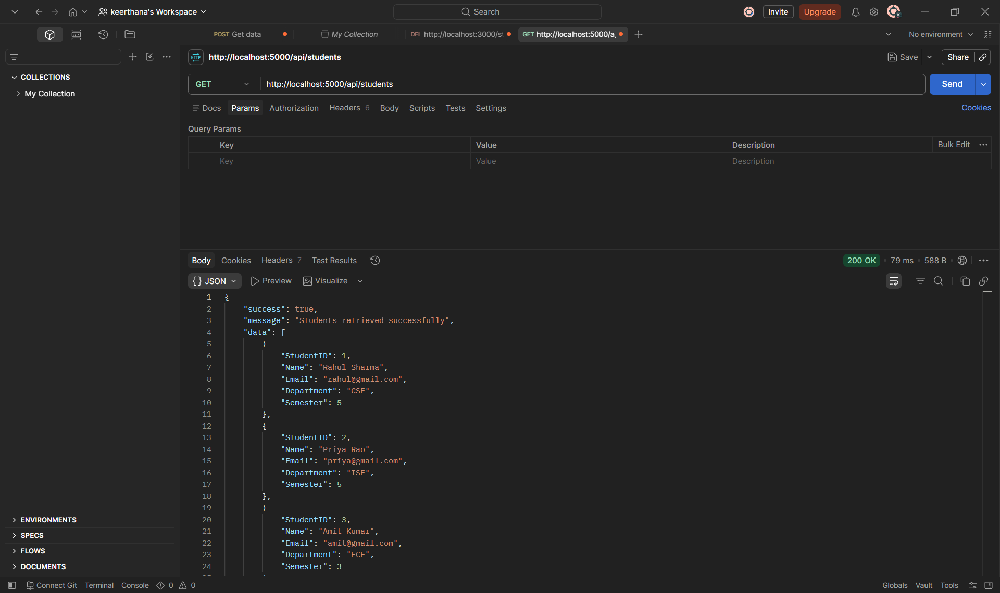
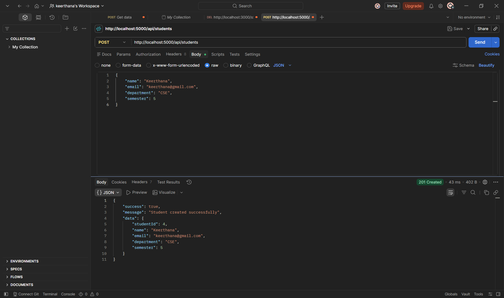

# 🎓 College Event API

A RESTful Backend API developed using **Node.js**, **Express.js**, and **MySQL** following the **MVC (Model-View-Controller)** architecture. This project demonstrates how to connect an Express backend with a MySQL database using a connection pool and perform database operations through REST APIs.

---

## 🚀 Features

- Node.js and Express.js Backend
- MySQL Database Integration
- MVC Architecture
- MySQL Connection Pool (`mysql2/promise`)
- RESTful APIs
- Environment Variables using `.env`
- Global Error Handling
- Standardized API Responses
- GET and POST Student APIs

---

## 🛠️ Technologies Used

- Node.js
- Express.js
- MySQL Server
- MySQL Workbench
- mysql2
- dotenv
- Nodemon
- Postman
- Git & GitHub
- VS Code

---

## 📁 Project Structure

```text
college-event-api/
│
├── config/
│   └── db.js
│
├── controllers/
│   └── student.controller.js
│
├── services/
│   └── student.service.js
│
├── routes/
│   └── student.routes.js
│
├── middleware/
│   └── error.middleware.js
│
├── utils/
│   └── apiResponse.js
│
├── screenshots/
│   ├── get-api.png
│   ├── post-api.png
│   └── students-table.png
│
├── .env
├── .gitignore
├── package.json
├── package-lock.json
├── server.js
└── README.md
```

---

## 🗄️ Database

**Database Name**

```sql
college_event_db
```

**Table Name**

```sql
Students
```

### Table Structure

| Column | Data Type |
|----------|-----------|
| StudentID | INT (Primary Key, Auto Increment) |
| Name | VARCHAR(100) |
| Email | VARCHAR(100) UNIQUE |
| Department | VARCHAR(50) |
| Semester | INT |

---

## ⚙️ Installation

### Clone the Repository

```bash
git clone https://github.com/keerthanapolaki-1333/college-event-api.git
```

### Navigate to the Project

```bash
cd college-event-api
```

### Install Dependencies

```bash
npm install
```

---

## 🔐 Environment Variables

Create a `.env` file in the project root.

```env
PORT=5000

DB_HOST=localhost
DB_USER=root
DB_PASSWORD=YOUR_MYSQL_PASSWORD
DB_NAME=college_event_db
DB_PORT=3306
```

---

## ▶️ Running the Project

### Development Mode

```bash
npm run dev
```

### Production Mode

```bash
npm start
```

---

## 📡 API Endpoints

### 1. Get All Students

**Method**

```http
GET /api/students
```

**URL**

```text
http://localhost:5000/api/students
```

**Response**

```json
{
  "success": true,
  "message": "Students retrieved successfully",
  "data": [
    {
      "StudentID": 1,
      "Name": "Rahul Sharma",
      "Email": "rahul@gmail.com",
      "Department": "CSE",
      "Semester": 5
    }
  ]
}
```

---

### 2. Create Student

**Method**

```http
POST /api/students
```

**URL**

```text
http://localhost:5000/api/students
```

**Request Body**

```json
{
  "name": "Keerthana",
  "email": "keerthana@gmail.com",
  "department": "CSE",
  "semester": 5
}
```

**Response**

```json
{
  "success": true,
  "message": "Student created successfully",
  "data": {
    "studentId": 4,
    "name": "Keerthana",
    "email": "keerthana@gmail.com",
    "department": "CSE",
    "semester": 5
  }
}
```

---

# 📸 Screenshots

## GET Students API



---

## POST Student API



---

## Students Table in MySQL


---

## 🧪 Testing

Test the APIs using **Postman**.

### GET

```http
GET http://localhost:5000/api/students
```

### POST

```http
POST http://localhost:5000/api/students
```

---

## 📦 Dependencies

- express
- mysql2
- dotenv
- nodemon

---

## 📚 Learning Outcomes

- Express.js Fundamentals
- MySQL Database Connectivity
- MVC Architecture
- REST API Development
- Connection Pooling
- Environment Variables
- Service Layer
- Error Handling
- Git & GitHub Workflow

---

## 👨‍💻 Author

**Keerthana Polaki**

GitHub: https://github.com/keerthanapolaki-1333

---

## ⭐ Future Enhancements

- Get Student by ID
- Update Student Details
- Delete Student
- Input Validation
- Authentication & Authorization
- Pagination
- Search & Filter Students
- Unit Testing